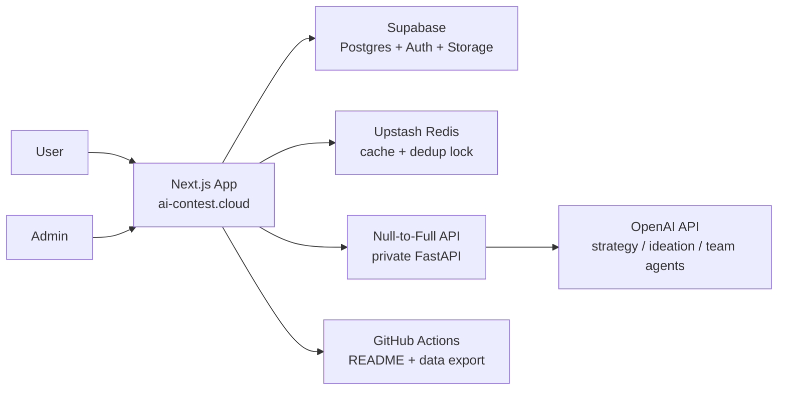

# AI Contest Cloud

한국 대학생·취준생이 AI 공모전을 빠르게 탐색하고, 전략 분석부터 브레인스토밍, 팀 시뮬레이션까지 이어서 준비할 수 있게 만든 Next.js 기반 서비스입니다. 이 저장소는 공개 프론트엔드이면서 동시에 Supabase를 읽고 쓰는 BFF 역할도 같이 맡습니다.

## Live

- App: [www.ai-contest.cloud](https://www.ai-contest.cloud)
- Admin: [www.ai-contest.cloud/admin/login](https://www.ai-contest.cloud/admin/login)
- API backend: [api.ai-contest.cloud](https://api.ai-contest.cloud)

## What This Repo Owns

- 공모전 탐색, 상세, 로그인, 관리자 등록 UI
- Supabase 기반 공모전/분석/팀 시뮬레이션 데이터 읽기·쓰기
- 전략 분석, 브레인스토밍, 팀 시뮬레이션 요청을 private AI 서버로 전달하는 BFF 레이어
- async AI job 큐, 상태 polling, SSE 기반 활동 로그 스트림
- README/JSON export, GitHub Actions, Vercel 배포 워크플로

## Stack

- Next.js 16 App Router
- React 19
- Tailwind CSS 4
- Supabase
- Upstash Redis
- Vercel

## Architecture



핵심 경계는 아래처럼 나뉩니다.

- 이 저장소는 사용자 경험, 세션, DB 기록, 비동기 job orchestration을 담당합니다.
- 실제 LLM/에이전트 실행은 private backend인 `Null-to-Full`에서 처리합니다.
- 실패 시 일부 플로우는 이 저장소 내부 fallback 로직으로 내려올 수 있습니다.

## Product Flows

### 1. Contest discovery

- 홈과 탐색 화면에서 `마감`, `보상`, `주최 성격`, `학생 적합도`, `카테고리`를 기준으로 공모전을 필터링합니다.
- 상세 페이지는 첫 화면에서 바로 `지원 판단`이 되도록 설계되어 있습니다.
- 관련 진입점:
  - [/Users/lux/Documents/ai-contest.cloud/app/page.tsx](/Users/lux/Documents/ai-contest.cloud/app/page.tsx)
  - [/Users/lux/Documents/ai-contest.cloud/app/contests/page.tsx](/Users/lux/Documents/ai-contest.cloud/app/contests/page.tsx)
  - [/Users/lux/Documents/ai-contest.cloud/app/contests/[slug]/page.tsx](/Users/lux/Documents/ai-contest.cloud/app/contests/%5Bslug%5D/page.tsx)

### 2. Strategy analysis

- 상세 페이지의 `AI 전략 리포트`는 private AI 서버를 우선 호출합니다.
- 응답은 전략 요약, 아이디어 제안, 인용 소스, 전략 초안으로 저장됩니다.
- heavy 작업은 즉시 처리 대신 async job으로 큐에 넣고 polling으로 완료 상태를 받습니다.
- 관련 구현:
  - [/Users/lux/Documents/ai-contest.cloud/app/api/contests/[slug]/strategy-lab/jobs/route.ts](/Users/lux/Documents/ai-contest.cloud/app/api/contests/%5Bslug%5D/strategy-lab/jobs/route.ts)
  - [/Users/lux/Documents/ai-contest.cloud/lib/server/contest-strategy-pipeline.ts](/Users/lux/Documents/ai-contest.cloud/lib/server/contest-strategy-pipeline.ts)
  - [/Users/lux/Documents/ai-contest.cloud/lib/server/ai-generation-jobs.ts](/Users/lux/Documents/ai-contest.cloud/lib/server/ai-generation-jobs.ts)

### 3. Golden Circle ideation

- 상세 페이지에서 `이 공모전 준비 시작하기`를 누르면 로그인 후 브레인스토밍 모달이 열립니다.
- 플로우는 `꿈꾸기 -> 아이디어 뽑기 -> 최종 선택 & 팀 짜기` 3단계로 단순화돼 있습니다.
- step 생성도 async job으로 queue 처리하고, 이전 입력과 같으면 프론트에서 캐시해 재생성을 피합니다.
- 관련 구현:
  - [/Users/lux/Documents/ai-contest.cloud/components/contest-preparation-experience.tsx](/Users/lux/Documents/ai-contest.cloud/components/contest-preparation-experience.tsx)
  - [/Users/lux/Documents/ai-contest.cloud/components/contest-ideation-modal.tsx](/Users/lux/Documents/ai-contest.cloud/components/contest-ideation-modal.tsx)
  - [/Users/lux/Documents/ai-contest.cloud/lib/server/ideation-generation-jobs.ts](/Users/lux/Documents/ai-contest.cloud/lib/server/ideation-generation-jobs.ts)

### 4. Team simulation

- 아이디어를 확정하면 `/team/[contestId]?session=<ideationSessionId>`로 handoff 됩니다.
- 팀은 공고/심사기준/확정 아이디어 기준으로 동적으로 생성됩니다.
- 이후 채팅, 할 일, 작업물, 우승 준비도 패널이 있는 팀 시뮬레이션 대시보드로 이어집니다.
- team bootstrap과 team turn도 async job으로 분리되어 있습니다.
- 활동 로그는 SSE로 스트리밍합니다.
- 관련 구현:
  - [/Users/lux/Documents/ai-contest.cloud/app/team/[contestId]/page.tsx](/Users/lux/Documents/ai-contest.cloud/app/team/%5BcontestId%5D/page.tsx)
  - [/Users/lux/Documents/ai-contest.cloud/components/team-simulation-dashboard.tsx](/Users/lux/Documents/ai-contest.cloud/components/team-simulation-dashboard.tsx)
  - [/Users/lux/Documents/ai-contest.cloud/app/api/team/[contestId]/events/route.ts](/Users/lux/Documents/ai-contest.cloud/app/api/team/%5BcontestId%5D/events/route.ts)
  - [/Users/lux/Documents/ai-contest.cloud/lib/server/team-generation-jobs.ts](/Users/lux/Documents/ai-contest.cloud/lib/server/team-generation-jobs.ts)

## Current Contest Lineup

README also works as a lightweight public lineup page, similar to curated event repos.  
The latest details always live in the app, and the same snapshot is also exported to [`data/contests.json`](/Users/lux/Documents/ai-contest.cloud/data/contests.json) for external reuse.

<!-- lineup:start -->
### 마감임박
곧 닫히는 공모전부터 빠르게 확인할 수 있게 정리한 섹션입니다.

| Deadline | Contest | Organizer | Prize | Category |
| --- | --- | --- | --- | --- |
| 2026-03-14 | [OpenAI Safety Sprint](https://ai-contest-cloud.vercel.app/contests/openai-safety-sprint) | OpenAI Builders | 약 7,250만원 | LLM / 에이전트, AI 인프라 / 시스템 |
| 2026-03-16 | [Multimodal Studio Jam](https://ai-contest-cloud.vercel.app/contests/multimodal-studio-jam) | Creator Tools Collective | 약 2,175만원 | 멀티모달 AI, 생성형 AI |
| 2026-03-21 | [Campus RAG League](https://ai-contest-cloud.vercel.app/contests/campus-rag-league) | Korea AI Student Network | 약 870만원 | LLM / 에이전트, 사회문제 해결 AI |
| 2026-03-25 | [RoboOps Field Test](https://ai-contest-cloud.vercel.app/contests/roboops-field-test) | Autonomy Works | 약 1,740만원 | 로보틱스, AI 인프라 / 시스템 |

### 상금순
총상금 규모가 큰 순서대로 상위 라인업을 모았습니다.

| Deadline | Contest | Organizer | Prize | Category |
| --- | --- | --- | --- | --- |
| 2026-03-14 | [OpenAI Safety Sprint](https://ai-contest-cloud.vercel.app/contests/openai-safety-sprint) | OpenAI Builders | 약 7,250만원 | LLM / 에이전트, AI 인프라 / 시스템 |
| 2026-04-12 | [Healthcare AI Signal Cup](https://ai-contest-cloud.vercel.app/contests/healthcare-ai-signal-cup) | MediSignal Foundation | 약 4,350만원 | 데이터 사이언스, 사회문제 해결 AI |
| 2026-04-05 | [Vision for Climate Challenge](https://ai-contest-cloud.vercel.app/contests/vision-for-climate) | Earth Compute Lab | 약 3,625만원 | 컴퓨터 비전, 사회문제 해결 AI |
| 2026-03-16 | [Multimodal Studio Jam](https://ai-contest-cloud.vercel.app/contests/multimodal-studio-jam) | Creator Tools Collective | 약 2,175만원 | 멀티모달 AI, 생성형 AI |
| 2026-03-25 | [RoboOps Field Test](https://ai-contest-cloud.vercel.app/contests/roboops-field-test) | Autonomy Works | 약 1,740만원 | 로보틱스, AI 인프라 / 시스템 |

### 대학생 추천
학생 포트폴리오와 첫 지원 경험에 잘 맞는 대회를 우선 모았습니다.

| Deadline | Contest | Organizer | Prize | Category |
| --- | --- | --- | --- | --- |
| 2026-03-14 | [OpenAI Safety Sprint](https://ai-contest-cloud.vercel.app/contests/openai-safety-sprint) | OpenAI Builders | 약 7,250만원 | LLM / 에이전트, AI 인프라 / 시스템 |
| 2026-03-21 | [Campus RAG League](https://ai-contest-cloud.vercel.app/contests/campus-rag-league) | Korea AI Student Network | 약 870만원 | LLM / 에이전트, 사회문제 해결 AI |
| 2026-04-03 | [폭스바겐 골프 GTI 대학생 AI 영상 광고 공모전](https://ai-contest-cloud.vercel.app/contests/gti-ai) | 이오스커뮤니케이션스 | 약 400만원 + 해외 프로그램 | 생성형 AI |
| 2026-04-05 | [Vision for Climate Challenge](https://ai-contest-cloud.vercel.app/contests/vision-for-climate) | Earth Compute Lab | 약 3,625만원 | 컴퓨터 비전, 사회문제 해결 AI |
<!-- lineup:end -->

## Data Model

주요 테이블은 아래 4개 축으로 나뉩니다.

- 공모전 원본/분석
  - `contests`
  - `contest_badges`
  - `contest_ai_analysis`
  - `contest_strategy_reports`
  - `contest_strategy_sources`
- 브레인스토밍
  - `contest_ideation_sessions`
  - `contest_ideation_candidates`
- 팀 시뮬레이션
  - `team_sessions`
  - `team_members`
  - `team_messages`
  - `team_tasks`
  - `team_artifacts`
  - `team_score_events`
  - `team_activity_events`
- async jobs
  - `ai_generation_jobs`

마이그레이션은 [`supabase/migrations`](/Users/lux/Documents/ai-contest.cloud/supabase/migrations) 아래에서 관리합니다.

## Remote AI Integration

이 저장소는 private backend를 호출할 때 아래 원칙으로 움직입니다.

- JWT 서명으로 요청 인증
- `x-request-id` 전달
- bounded retry
- small circuit breaker
- optional Upstash Redis cache
- optional request dedup lock
- remote 실패 시 local fallback

관련 구현:

- [/Users/lux/Documents/ai-contest.cloud/lib/server/remote-ai-runtime.ts](/Users/lux/Documents/ai-contest.cloud/lib/server/remote-ai-runtime.ts)
- [/Users/lux/Documents/ai-contest.cloud/lib/server/contest-strategy-service.ts](/Users/lux/Documents/ai-contest.cloud/lib/server/contest-strategy-service.ts)
- [/Users/lux/Documents/ai-contest.cloud/lib/server/contest-ideation-service.ts](/Users/lux/Documents/ai-contest.cloud/lib/server/contest-ideation-service.ts)
- [/Users/lux/Documents/ai-contest.cloud/lib/server/contest-team-service.ts](/Users/lux/Documents/ai-contest.cloud/lib/server/contest-team-service.ts)

## Async Job Pipeline

LLM 응답 시간이 긴 흐름은 sync 요청으로 직접 기다리지 않고 job으로 넘깁니다.

- strategy report 생성
- ideation 다음 단계 생성
- team bootstrap
- team turn simulation

상태는 `queued / running / completed / failed`로 관리합니다.

동작 방식:

1. 클라이언트가 `/jobs` route에 작업 생성 요청
2. job row가 `ai_generation_jobs`에 저장
3. 상태 조회 route가 필요 시 drain을 한 번 수행
4. 완료되면 결과를 DB에 반영하고 최신 session/team state 반환

관련 구현:

- [/Users/lux/Documents/ai-contest.cloud/app/api/contests/[slug]/strategy-lab/jobs/route.ts](/Users/lux/Documents/ai-contest.cloud/app/api/contests/%5Bslug%5D/strategy-lab/jobs/route.ts)
- [/Users/lux/Documents/ai-contest.cloud/app/api/contests/[slug]/ideation/jobs/[jobId]/route.ts](/Users/lux/Documents/ai-contest.cloud/app/api/contests/%5Bslug%5D/ideation/jobs/%5BjobId%5D/route.ts)
- [/Users/lux/Documents/ai-contest.cloud/app/api/team/[contestId]/bootstrap/jobs/route.ts](/Users/lux/Documents/ai-contest.cloud/app/api/team/%5BcontestId%5D/bootstrap/jobs/route.ts)
- [/Users/lux/Documents/ai-contest.cloud/app/api/team/[contestId]/jobs/[jobId]/route.ts](/Users/lux/Documents/ai-contest.cloud/app/api/team/%5BcontestId%5D/jobs/%5BjobId%5D/route.ts)
- [/Users/lux/Documents/ai-contest.cloud/app/api/internal/ai-jobs/drain/route.ts](/Users/lux/Documents/ai-contest.cloud/app/api/internal/ai-jobs/drain/route.ts)

## Realtime UX

사용자가 가만히 기다리는 느낌이 들지 않도록 두 가지를 같이 씁니다.

- queue polling
- SSE activity stream

SSE는 팀 시뮬레이션 화면에서 `누가 지금 뭘 하는지`를 보여주는 용도로 사용합니다.

- [/Users/lux/Documents/ai-contest.cloud/app/api/team/[contestId]/events/route.ts](/Users/lux/Documents/ai-contest.cloud/app/api/team/%5BcontestId%5D/events/route.ts)
- [/Users/lux/Documents/ai-contest.cloud/components/team-simulation-dashboard.tsx](/Users/lux/Documents/ai-contest.cloud/components/team-simulation-dashboard.tsx)

## Auth and Admin

- 사용자 로그인: Supabase Auth + Google OAuth
- 관리자 로그인: allowlist 기반 Supabase Auth
- `/admin`은 allowlisted email만 접근 가능
- 공고 이미지 업로드는 admin 세션과 server-side validation을 거칩니다

관련 구현:

- [/Users/lux/Documents/ai-contest.cloud/lib/server/admin-auth.ts](/Users/lux/Documents/ai-contest.cloud/lib/server/admin-auth.ts)
- [/Users/lux/Documents/ai-contest.cloud/app/admin/login/page.tsx](/Users/lux/Documents/ai-contest.cloud/app/admin/login/page.tsx)
- [/Users/lux/Documents/ai-contest.cloud/app/api/admin/poster-upload/route.ts](/Users/lux/Documents/ai-contest.cloud/app/api/admin/poster-upload/route.ts)

## Search and Public Export

- README는 3시간마다 자동 갱신되는 공개 라인업 스냅샷 역할도 합니다.
- 같은 데이터는 [`data/contests.json`](/Users/lux/Documents/ai-contest.cloud/data/contests.json)으로도 export 됩니다.
- `published` 공고가 바뀌면 GitHub Actions를 즉시 dispatch 할 수 있습니다.

관련 구현:

- [/Users/lux/Documents/ai-contest.cloud/scripts/update-readme-lineup.ts](/Users/lux/Documents/ai-contest.cloud/scripts/update-readme-lineup.ts)
- [/Users/lux/Documents/ai-contest.cloud/.github/workflows/update-readme-lineup.yml](/Users/lux/Documents/ai-contest.cloud/.github/workflows/update-readme-lineup.yml)

## Reliability and Operations

이 저장소 기준으로 이미 들어간 운영 장치는 아래입니다.

- remote AI request ID 전달
- retry + circuit breaker
- Upstash Redis cache + dedup lock
- async jobs
- CI: lint + build
- smoke check: production route 상태 확인

아직 의도적으로 가볍게 둔 부분:

- queue worker는 별도 서비스가 아니라 app runtime + internal drain route 기반
- Upstash는 optional이며, 없으면 캐시 없이 동작
- 분산 tracing, persistent metrics, distributed rate limit은 private backend 기준 다음 단계 과제로 남겨둠

## Local Run

```bash
npm install
npm run dev
```

README 라인업과 `data/contests.json`을 다시 생성:

```bash
node --env-file=.env.local --import tsx scripts/update-readme-lineup.ts
```

queued AI job 수동 drain:

```bash
npm run ai-jobs:run -- 5
```

## Required Environment

```bash
NEXT_PUBLIC_SUPABASE_URL=...
NEXT_PUBLIC_SUPABASE_PUBLISHABLE_KEY=...
SUPABASE_DB_URL=...
SUPABASE_SERVICE_ROLE_KEY=...

OPENAI_API_KEY=...
OPENAI_MODEL=gpt-4o-mini

NULL_TO_FULL_API_BASE_URL=https://api.ai-contest.cloud
NULL_TO_FULL_API_JWT_SECRET=...
NULL_TO_FULL_API_JWT_ISSUER=ai-contest.cloud
NULL_TO_FULL_API_JWT_AUDIENCE=null-to-full
NULL_TO_FULL_API_SCOPE=contest_strategy.generate
NULL_TO_FULL_API_TIMEOUT_MS=45000
NULL_TO_FULL_API_MAX_ATTEMPTS=2
NULL_TO_FULL_API_RETRY_BASE_MS=400
NULL_TO_FULL_API_CIRCUIT_FAILURE_THRESHOLD=3
NULL_TO_FULL_API_CIRCUIT_COOLDOWN_MS=30000
NULL_TO_FULL_API_DEDUP_WAIT_MS=4000
NULL_TO_FULL_API_DEDUP_POLL_MS=250

UPSTASH_REDIS_REST_URL=...
UPSTASH_REDIS_REST_TOKEN=...

AI_JOB_RUNNER_BASE_URL=http://127.0.0.1:3000
AI_JOB_RUNNER_SECRET=...

ADMIN_SUPABASE_EMAIL=admin@example.com
ADMIN_SUPABASE_EMAILS=admin@example.com
ADMIN_SUPABASE_PASSWORD=...
```

env가 없으면 일부 화면은 seed/mock 데이터로 fallback 합니다.  
참고: [/Users/lux/Documents/ai-contest.cloud/lib/mock-contests.ts](/Users/lux/Documents/ai-contest.cloud/lib/mock-contests.ts)

## Supabase Setup

스키마 반영과 seed 동기화:

```bash
npm run supabase:sync
npm run analysis:backfill
```

핵심 흐름:

1. 관리자 입력 또는 공고 붙여넣기
2. `contests` 저장
3. badge refresh
4. AI 분석 생성 또는 pending 처리
5. ideation/team session이 이어서 저장

## GitHub Actions

이 저장소에는 다음 workflow가 포함됩니다.

- `ci.yml`
  - `npm ci -> lint -> build`
- `smoke-prod.yml`
  - production route 헬스 체크
- `update-readme-lineup.yml`
  - README + `data/contests.json` 자동 갱신

즉시 refresh용 env:

- `GITHUB_CONTENT_REFRESH_TOKEN`
- `GITHUB_CONTENT_REFRESH_OWNER`
- `GITHUB_CONTENT_REFRESH_REPO`
- `GITHUB_CONTENT_REFRESH_WORKFLOW_ID`
- `GITHUB_CONTENT_REFRESH_REF`

## Related Private Service

실제 AI 서버 문서는 private repo README를 참고합니다.

- [/Users/lux/Documents/Null-to-Full/README.md](/Users/lux/Documents/Null-to-Full/README.md)
